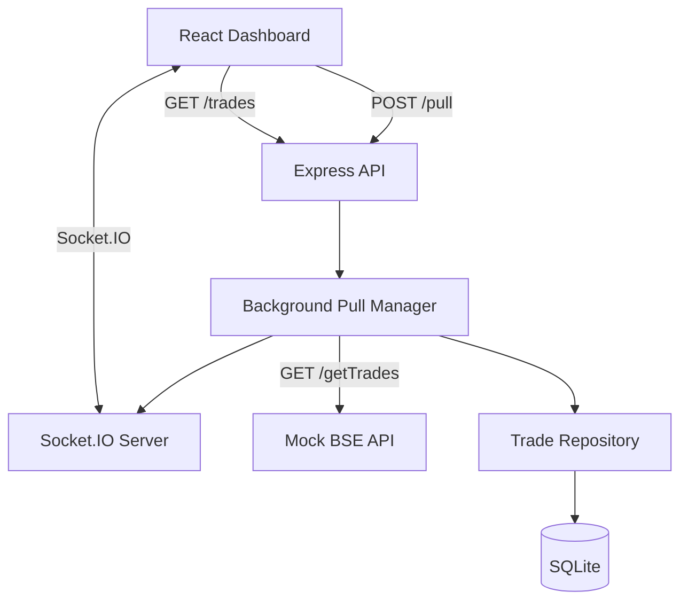

# BSE Trades Dashboard

Real-time Indian equity market trade ingestion dashboard demonstrating asynchronous background pull handling for long-running upstream fetches with real-time push streaming over WebSockets.

---

## Problem

- **Long-Running Pull**: Upstream BSE data fetches may take up to 15 minutes to generate and return several thousand trade records.
- **Network Constraint**: Network proxies, load balancers, and gateways terminate HTTP connections held open for longer than 30 seconds.
- **Requirement**: The client must never hold a synchronous HTTP request open while waiting for the full BSE pull, and open dashboards must automatically receive newly pulled trades without manual page refreshes or client-side polling loops.

---

## Solution

The system decouples the user-facing pull trigger from the slow upstream ingestion:

```text
POST /pull
    ↓
Immediate HTTP 202 + jobId (< 5 ms)
    ↓
Background Pull Manager (In-Process Async Worker)
    ↓
Mock BSE API (GET /getTrades — supports up to 15-minute simulated delay)
    ↓
SQLite Persistence (Atomic batch transaction & duplicate filtering)
    ↓
Socket.IO Push Event (trades:new containing only newly inserted records)
    ↓
Live React Dashboard Updates Dynamically (Zero page refresh)
```

This architecture completely eliminates the 30-second network timeout problem because the client HTTP request terminates in milliseconds, while the background process completes independently and pushes updates over an existing WebSocket connection.

---

## Key Features

- **Instant Initial Render**: Reads already-persisted SQLite records (`GET /trades`) immediately on page mount (< 10 ms).
- **Asynchronous Background Pull**: `POST /pull` returns HTTP 202 in milliseconds while upstream fetching proceeds in the background.
- **SQLite Persistence**: Embedded storage with unique constraints on `tradeId` and transactional conflict resolution.
- **Real-Time Push Updates**: Socket.IO broadcasts `trades:new` and `pull:completed` upon database commit.
- **Idempotent Ingestion**: Duplicate trades are safely ignored (`INSERT OR IGNORE`); duplicate-only pulls suppress redundant event emissions.
- **Concurrent Pull Protection**: Active pull concurrency lock returns HTTP 409 Conflict if a second pull is triggered simultaneously.
- **Interactive UI Controls**: Client-side search by Trade ID/Client, Indian stock symbol dropdown filter, and pagination (25/50/100 rows per page).
- **Zero Polling Guarantee**: No `setInterval`, no recursive `setTimeout`, no polling loops, and no cronjob/scheduler infrastructure.

---

## Tech Stack

### Frontend
- **React 18**: UI component tree and state management
- **Vite 6**: Frontend tooling and production bundler
- **Socket.IO Client**: Event-driven WebSocket connection layer

### Backend
- **Node.js & Express**: HTTP REST API layer and background task execution
- **Socket.IO**: WebSocket server attached to native HTTP server

### Storage
- **SQLite 3 (`better-sqlite3`)**: High-performance embedded synchronous database in WAL mode

### Testing
- **Node.js Test Runner / Assert**: 4 automated test suites (29 tests total)

---

## Architecture



### Why This Architecture?
1. **REST for Static Reads**: `GET /trades` serves fast, indexed reads for initial page loads and historical pagination without upstream dependencies.
2. **Decoupled Asynchronous Worker**: Decouples the slow 15-minute BSE pull from the HTTP client request-response lifecycle.
3. **Push vs. Pull**: WebSockets (Socket.IO) deliver newly persisted records instantly when the database transaction commits, avoiding redundant network polling loops.

---

## Repository Structure

```text
bse-trades-dashboard/
├── client/              # React + Vite frontend application
│   ├── src/
│   │   ├── components/  # Modular dashboard UI components
│   │   ├── hooks/       # useTradeSocket custom WebSocket hook
│   │   ├── services/    # api.js REST client service
│   │   ├── App.jsx      # Dashboard state and Socket.IO coordinator
│   │   └── App.css      # Dark financial terminal styling
│   ├── .env.example     # Client environment template
│   └── package.json
├── server/              # Node.js + Express backend service
│   ├── src/
│   │   ├── controllers/ # Request handlers (health, trades, pull)
│   │   ├── db/          # SQLite connection, schema & trade repository
│   │   ├── routes/      # REST API route definitions
│   │   ├── services/    # Mock BSE simulator & Background Pull Manager
│   │   └── websocket/   # Socket.IO server & event constants
│   ├── test/            # Automated test suites
│   ├── scripts/         # Verification and manual testing scripts
│   ├── .env.example     # Server environment template
│   └── package.json
├── docs/                # Architecture design notes & specifications
│   └── ARCHITECTURE.md
└── README.md            # Main documentation
```

---

## Prerequisites

- **Node.js**: v18.0.0 or higher (v20+ recommended)
- **npm**: v9.0.0 or higher

---

## Setup

Clone the repository and install dependencies for both backend and frontend:

```bash
git clone https://github.com/aloksinha123/bse-trades-dashboard.git
cd bse-trades-dashboard

# Install server dependencies
cd server
npm install

# Install client dependencies
cd ../client
npm install
```

### Environment Configuration

Create `.env` files from provided templates:

```bash
# In server directory
cp .env.example .env

# In client directory
cp .env.example .env
```

---

## Environment Variables

### Server (`server/.env`)
| Variable | Default | Description |
| :--- | :--- | :--- |
| `PORT` | `5000` | HTTP port for Express and Socket.IO server |
| `CLIENT_ORIGIN` | `http://localhost:5173` | Allowed CORS origin for frontend client |
| `NODE_ENV` | `development` | Application runtime environment |
| `BSE_DELAY_MS` | `5000` | Simulated upstream BSE delay in ms (up to `900000` ms / 15 mins) |
| `DATABASE_PATH` | `./data/trades.db` | Local SQLite database file path |

### Client (`client/.env`)
| Variable | Default | Description |
| :--- | :--- | :--- |
| `VITE_API_BASE_URL` | `http://localhost:5000` | Backend REST API base URL |
| `VITE_SOCKET_URL` | `http://localhost:5000` | Backend Socket.IO server URL |

---

## Running the Project

Run backend and frontend in two separate terminal windows:

### Terminal 1: Start Backend Server
```bash
cd server
npm run dev
```
*Server will start on `http://localhost:5000` (Database auto-initializes with 500 initial records).*

### Terminal 2: Start Frontend Dashboard
```bash
cd client
npm run dev
```
*Vite client will start on `http://localhost:5173`.*

---

## Demo Flow

### 1. Initial State & First Pull
1. Open `http://localhost:5173` in a web browser.
2. Dashboard renders immediately displaying the initial **500** persisted trades.
3. Status pill displays **`● LIVE Connected`**.
4. Click **Start New Pull**.
5. HTTP request returns immediately (status flips to **Running**, button disables).
6. BSE pull runs asynchronously in the background.
7. After the configured delay (default 5s), the server persists new records and emits `trades:new`.
8. The dashboard dynamically updates from **500** to **4,000** trades **without page refresh**.
9. Pull Status updates to **Completed** with exact metrics:
   - **Fetched**: `4,000`
   - **Inserted (New)**: `3,500`
   - **Duplicates Ignored**: `500`

### 2. Second Pull (Idempotency Demo)
1. Click **Start New Pull** a second time.
2. Pull runs in the background.
3. On completion, metrics update to:
   - **Fetched**: `4,000`
   - **Inserted (New)**: `0`
   - **Duplicates Ignored**: `4,000`
4. Total trades remains unchanged at **4,000**, and no redundant `trades:new` event is broadcast.

---

## API Reference

### Health Check
- `GET /health` *(Fast)*: Returns service health status (`{"status": "ok"}`).

### Persisted Application Trades
- `GET /trades` *(Fast — < 10 ms)*: Retrieves already-persisted trades from SQLite. Supports optional query parameters `limit` (default: 50, max: 500) and `offset` (default: 0).

### Trigger Background Ingestion
- `POST /pull` *(Fast — < 5 ms)*: Initiates asynchronous BSE pull worker. Returns HTTP `202 Accepted` immediately with the generated `jobId`.

### Job Status
- `GET /pull/:jobId` *(Fast — < 2 ms)*: Retrieves in-memory status (`running`, `completed`, `failed`) and metrics for a specific job.

### Job History
- `GET /pulls` *(Fast — < 2 ms)*: Returns a list of recent in-memory pull jobs (newest first).

### Mock BSE Feed (Simulated Upstream)
- `GET /getTrades` *(Configurable Latency)*: Upstream simulator returning 4,000 deterministic seeded records. Subject to `BSE_DELAY_MS` artificial delay (up to 15 minutes).

---

## Socket.IO Events

| Event Name | Trigger | Payload Structure |
| :--- | :--- | :--- |
| `pull:started` | Emitted when background job starts | `{"jobId": "pull-...", "status": "running", "startedAt": "..."}` |
| `trades:new` | Emitted after SQLite commits newly inserted rows | `{"jobId": "pull-...", "count": 3500, "trades": [...]}` |
| `pull:completed` | Emitted when ingestion finishes | `{"jobId": "pull-...", "status": "completed", "totalFetched": 4000, "insertedCount": 3500, "duplicateCount": 500, "completedAt": "..."}` |
| `pull:failed` | Emitted on upstream failure | `{"jobId": "pull-...", "status": "failed", "error": "..."}` |

---

## Testing & Build

### Backend Automated Test Suites
Run the 4 automated backend test suites:
```bash
cd server
npm test
```
**Results (29/29 Tests Passing)**:
- `test/mockBse.test.js`: 6 tests (schema, uniqueness, PRNG consistency, delay validation)
- `test/tradeRepository.test.js`: 9 tests (schema, seed, duplicate ignore, batch transactions, pagination, restart)
- `test/pullManager.test.js`: 9 tests (non-blocking < 50 ms, concurrency lock, state transitions, isolation)
- `test/websocket.test.js`: 5 tests (client connection, event ordering, duplicate suppression, failure emissions)

### Frontend Production Build
Verify the React/Vite production bundle builds cleanly:
```bash
cd client
npm run build
```

---

## Design Decisions & Trade-Offs

1. **Decoupled Asynchronous Pull**: Solves the central 30-second network timeout constraint by closing the client HTTP connection in milliseconds while long-running work continues in the background.
2. **SQLite (`better-sqlite3`)**: Chosen for zero-dependency local reproducibility and synchronous C-binding execution with fast WAL mode transactions.
3. **Socket.IO Real-Time Push**: Eliminates frontend polling loops (`setInterval`) and server cron jobs by pushing updates immediately when the database commit occurs.
4. **Scope & Infrastructure Boundary**: Job metadata is managed in an in-memory `Map` within a single Node.js process. Distributed queue systems (Redis, BullMQ, Kafka) were intentionally excluded to keep the implementation self-contained and reproducible without external infrastructure.

---

## Manual WebSocket Verification Script

To verify Socket.IO event streaming directly from the terminal without the browser:

```bash
cd server
node scripts/testWsClient.js
```

**Expected Terminal Output**:
```text
[Manual WS] Connecting to Socket.IO server at http://localhost:5000...
[Manual WS] Connected successfully with socket ID: ...
[Manual WS] Triggering POST /pull to initiate background BSE fetch...
[Manual WS] pull:started -> Job ID: pull-... (status: running)
[Manual WS] POST /pull HTTP status: 202 (Response time: 8 ms)
[Manual WS] Waiting for background push events from server...
[Manual WS] trades:new -> Received 3500 newly inserted trades!
[Manual WS] pull:completed -> Fetched: 4000, Inserted: 3500, Duplicates: 500
[Manual WS] Real-time event cycle finished successfully!
```

---

## Assessment Verification Checklist

- [x] Dashboard opens instantly with persisted trades (< 10 ms).
- [x] Handled 30-second network timeout constraint via decoupled async pull (`POST /pull` < 5 ms).
- [x] No client-facing HTTP connection held open during long BSE pulls.
- [x] Real-time updates delivered via Socket.IO push events.
- [x] Zero polling loops (`setInterval`, recursive `setTimeout`).
- [x] Zero cron jobs or scheduler libraries.
- [x] Idempotent ingestion (duplicate trades safely ignored).
- [x] 409 Conflict protection on concurrent pull requests.

---

## Demo / Video

Video Walkthrough: `<add link here before submission>`

---

## License

ISC
