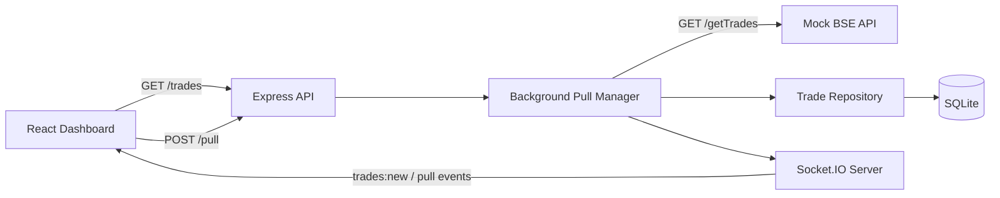

# Architecture Note

## Problem

- **BSE Ingestion Latency**: Upstream BSE data extraction can take up to 15 minutes (`BSE_DELAY_MS` configurable up to 900,000 ms).
- **Network Constraint**: Network proxies, load balancers, and gateways terminate HTTP connections held open for longer than 30 seconds.
- **Consequence**: The client cannot synchronously wait for the BSE response without risking premature connection termination.

---

## Architecture Diagram



---

## Why This Design

1. **Fast Initial Render**: `GET /trades` queries indexed SQLite storage, returning persisted records in < 10 ms without touching upstream BSE.
2. **Immediate Decoupled Trigger**: `POST /pull` registers an in-memory job and returns HTTP `202 Accepted` (< 5 ms), freeing the client HTTP connection.
3. **Asynchronous Background Processing**: Upstream BSE extraction runs independently inside the Node.js event loop without connection timeout hazards.
4. **Persistent Local Storage**: SQLite stores trades with unique constraints, ensuring data durability across server restarts.
5. **Real-Time Event Delivery**: Socket.IO broadcasts newly persisted trades directly to open dashboard instances immediately upon transaction commit.
6. **Zero Polling Overhead**: Eliminates client-side `setInterval` polling loops and server-side cronjob schedulers.
7. **Resolves the 30-Second Constraint**: Client requests complete in milliseconds; long-running data delivery occurs via persistent WebSocket push.

---

## Event Flow

```text
Client Dashboard
    │
    │ 1. POST /pull
    ▼
Express API Layer
    │
    ├──────────────► 2. Immediate HTTP 202 Accepted (< 5 ms)
    │
    ▼
Background Pull Manager
    │
    ├──────────────► 3. Socket.IO emits "pull:started"
    │
    ▼ 4. Fetches upstream (simulates up to 15-min delay)
Mock BSE API (GET /getTrades)
    │
    ▼ 5. Returns 4,000 trades
Trade Repository
    │
    ▼ 6. Atomic batch transaction & conflict resolution
SQLite Storage (trades.db)
    │
    ▼ 7. Identifies newly inserted records
Socket.IO Server
    │
    ├──────────────► 8. Emits "trades:new" (only if new records inserted)
    └──────────────► 9. Emits "pull:completed" (final metrics)
```

---

## Data Consistency

- **Unique Trade Identifier**: Each trade has a unique `tradeId` enforced by a primary SQLite constraint (`UNIQUE(tradeId)`).
- **Atomic Conflict Resolution**: Repository executes `INSERT OR IGNORE` inside a single atomic transaction.
- **Persistence Precedes Notification**: Socket.IO events (`trades:new`) are emitted **only after** SQLite successfully commits the transaction.
- **Duplicate-Free Payloads**: The `trades:new` event payload contains only records that were actually inserted during that batch.

---

## Concurrency Protection

- The `PullManagerService` enforces a single-active-pull invariant using an in-memory lock (`activeJobId`).
- If a client triggers `POST /pull` while a background pull is running, the server rejects the request immediately with **HTTP 409 Conflict** (`"A pull is already in progress."`).
- Prevents overlapping batch transactions and redundant upstream load.

---

## Failure Handling

- Upstream fetch errors or timeouts are caught in a `try/catch` block within the asynchronous worker.
- On error:
  - Job status updates to `failed` with a safe error message.
  - Socket.IO emits `pull:failed`.
  - The concurrency lock is released in a `finally` block to keep the service operational.

---

## Scope & Architectural Trade-offs

- **In-Memory Job Registry**: Pull job metadata (`Map<jobId, job>`) is kept in memory for lightweight execution within a single Node.js process. Trade records themselves are durably stored in SQLite.
- **Single-Process Architecture**: Designed for complete local reproducibility without requiring external queue infrastructure (e.g., Redis, BullMQ, RabbitMQ, Kafka).
- **Embedded SQLite**: Synchronous C-bindings (`better-sqlite3`) in WAL mode provide high-throughput local persistence with zero external service dependencies.
